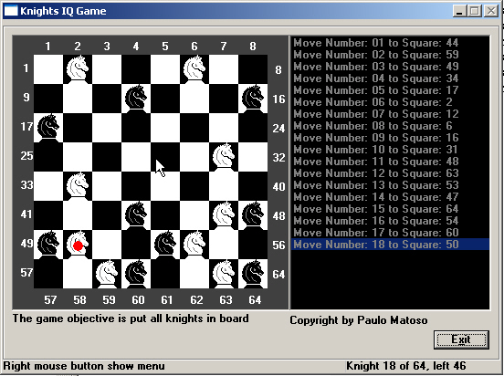



## Knights IQ Game 1\.0

### Description

This game test your mind. In a board with 8x8 squares, you need fill all squares with knights(Rule of knight is same of a chess game).

Who can solve this game without see my solutions?

The game has a Undo function and a 2 demos for u see how win this game. The source code is good for beginers and intermediate programmers.

If u like this game, don´t forget to vote.
 
### More Info
 

             |
---                |---
**Submitted On**   |2002-12-13 03:05:24
**By**             |[Paulo Matoso](https://github.com/Planet-Source-Code/PSCIndex/blob/master/ByAuthor/paulo-matoso.md)
**Level**          |Intermediate
**User Rating**    |5.0 (10 globes from 2 users)
**Compatibility**  |VB 5\.0, VB 6\.0
**Category**       |[Games](https://github.com/Planet-Source-Code/PSCIndex/blob/master/ByCategory/games__1-38.md)
**World**          |[Visual Basic](https://github.com/Planet-Source-Code/PSCIndex/blob/master/ByWorld/visual-basic.md)
**Archive File**   |[Knights\_IQ15123412132002\.zip](https://github.com/Planet-Source-Code/paulo-matoso-knights-iq-game-1-0__1-41548/archive/master.zip)

